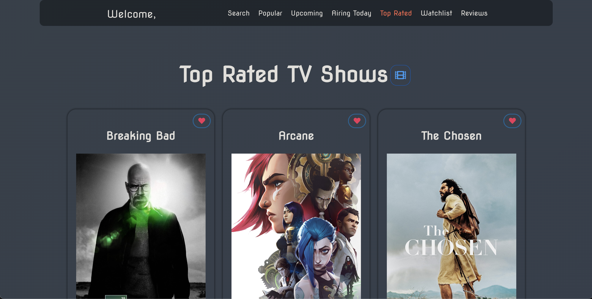

<h1 align="center">Watchlistr</h1>




Watchlistr is a web application that allows you to create an account to search for and discover popular &and top-rated movies and TV shows, as well as TV shows airing today and upcoming movies (both updates periodically). Plus, with the personal watchlist feature, you can create and save your must-watch content for later.

This project is the inception of my journey into project development. Should you wish to adapt and enhance it, you're welcome to do so. I encourage a thorough read for seamless building and deployment of your Watchlistr website.

### Built Using

* React
* Node.js
* Express.js
* Axios
* Vercel
* Render
* FreeDBTech
* PHPMyAdmin
* UptimeRobot
* The Movie Database (TMDB) API
* ToastUI

### Getting Started

To get started with the app, follow these steps:

1. **Clone the Repository:**
- ```git clone https://github.com/devzano/Watchlistr-Web.git```

2. **Install Dependencies:**
- Run `npm install` in the root directory of `React` & `ExpressMySQL`.

3. **Set Up the Database:**
- Signup for a free database with [FreeDBTech](https://freedb.tech/register.html).
- Replace ***`user`*** & ***`database`*** with your __`user`__ & __`database`__ inside `ExpressMySQL/index.js`.
- Access [PHPMyAdmin](https://phpmyadmin.freedb.tech/index.php?route=/) via the FreeDB Free Database Panel.
- Input database credentials to login.
- Add the SQL queries from `data.sql` to set up the database.

4. **Create a Render Project:**
- Signup for an account on [Render](https://render.com/register).
- Create a web service.
- Build and depoly from repo.
- Connect repo.
- Change root directory to `ExpressMySQL`.
- Create a env variable in settings called `DATABASE_PASSWORD`, with the values of your database password.
- Create

1. **Obtain a TMDB API Key:**
- Signup for an account on [TMDB](https://www.themoviedb.org/account/signup).
- Obtain an API key.

1. **Create Environment Variables:**
- In the root directory of `React` & `ExpressMySQL`, create a file called `.env`.
- Add the following lines to ***React***:
  ```
  REACT_APP_TMDB_API_KEY=YOUR-API-KEY
  REACT_APP_RENDER_BACKEND_URL=YOUR-BACKEND-URL
  ```
- Add the following lines to ***ExpressMySQL***:
  ```
  DATABASE_PASSWORD=YOUR-DB-PASS
  ```
  <sup><sub>Note: If the password has special characters, put it in quotes.</sub></sup>

1. **Deploy to Vercel:**
- Create an account on [Vercel](https://vercel.com/signup).
- Deploy your project.
- Configure environmental variables on Vercel, including `REACT_APP_TMDB_API_KEY` `REACT_APP_RENDER_BACKEND_URL`.
- If importing from GitHub, ensure that the deployment root directory starts from `React`.

### Features

* __Popular Movies and TV Shows__ - displays a list of popular movies and TV shows, which users can click on to view more details.
* __Top-Rated Movies and TV Shows__ - displays a list of top-rated movies and TV shows, which users can click on to view more details.
* __TV Shows Airing Today__ - displays a list of TV shows airing today in the US, which users can click on to view more details.
* __Search__ - allows users to search for specific movies and TV shows by entering keywords into the search bar.
* __Watchlist__ - allows users to save the movie or TV show to a watchlist.

### Contributions

Contributions to the app are welcome! If you would like to contribute, please fork the repo and submit a pull request.

#### License

Copyright © 2023 devzano. All rights reserved.

##### Credits

* The TMDB API for providing movies and tv shows data.
* Running ```create-react-app``` for the initial app setup.
* Deploying on Vercel.
* Using Render as backend server.
* Having a small free database on FreeDBTech.